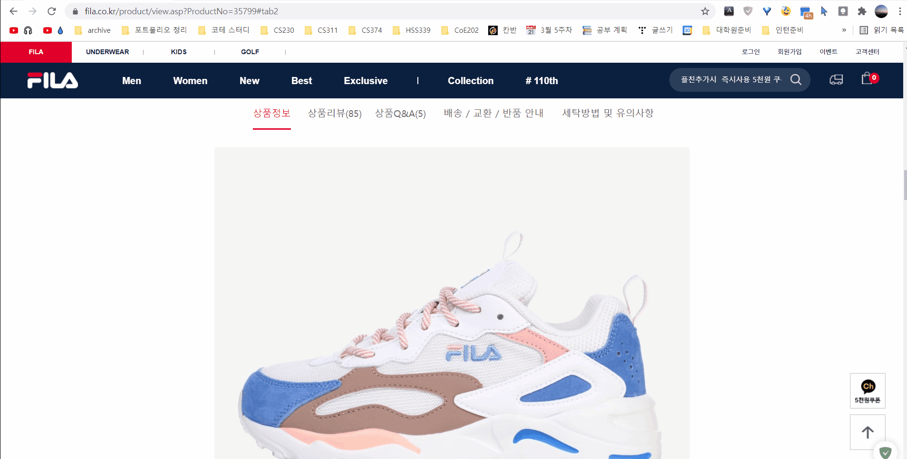
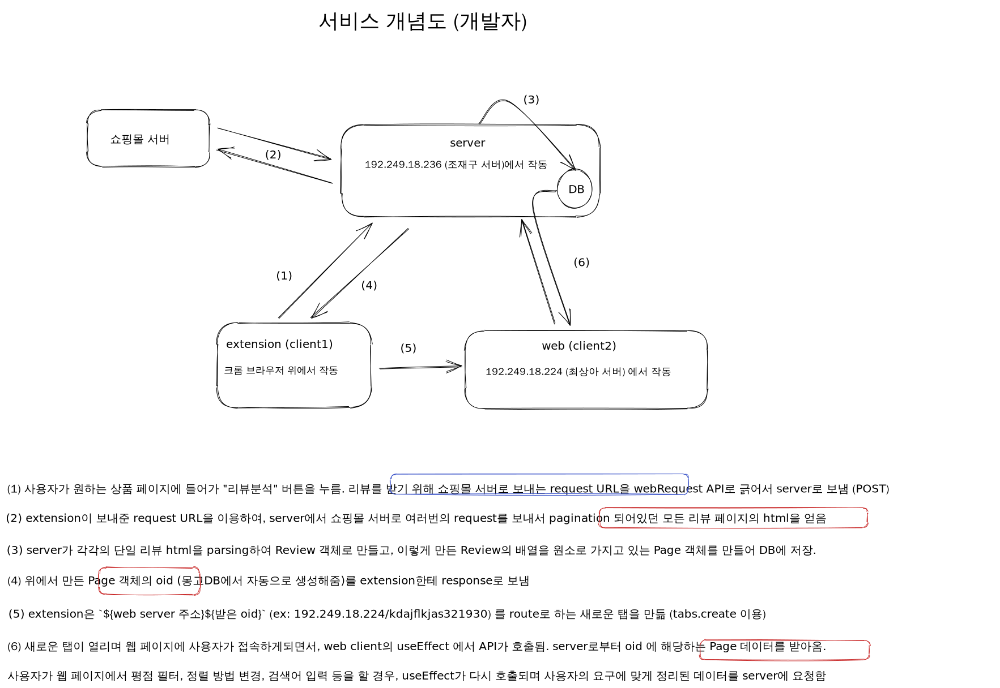

# D2CR: D2C 쇼핑몰 리뷰 분석기

## Demo

## Problem

- 유통 마진을 줄여 이익을 내는 D2C(Direct-to-Customer) 업체들이 점점 많아지고 있음
- 그러나 D2C 쇼핑몰에서는 제 3자인 유통 채널이 아닌 **상품 판매자가 리뷰를 관리**
- **나쁜 리뷰, 나쁜 키워드는 잘 보이지 않게하여 소비자의 정보권 침해**

## Solution

- **공개된 리뷰 정보를 소비자가 편하게 볼 수 있도록 재구성하여 제공**
- 기능 (2021.10)
    - 별점별 및 월별 통계
    - 별점별 필터
    - 검색
    - 형태소 분석 기능

## 서비스 개념도

